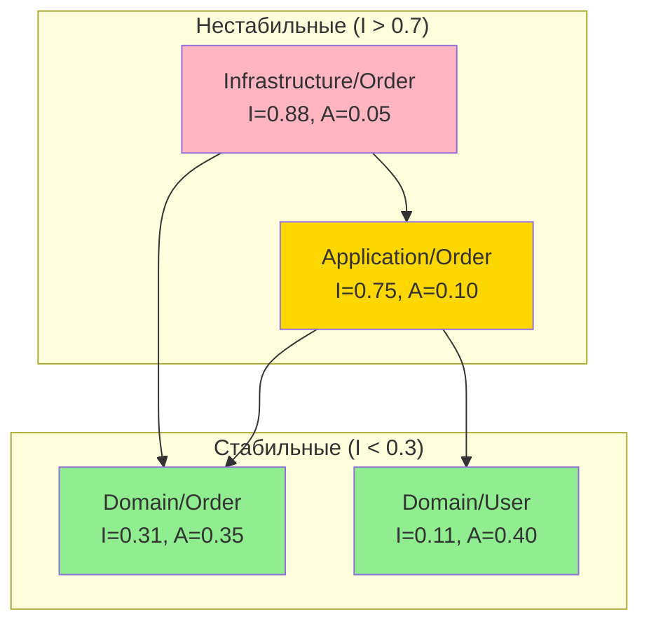

# Анализатор связанности и сплочённости

## Обзор

Этот навык анализирует PHP кодовые базы на метрики связанности и сплочённости, помогая выявлять архитектурные проблемы, такие как нестабильные зависимости, классы с низкой сплочённостью и сильно связанные модули.

## Справка по метрикам

| Метрика | Формула | Цель | Описание |
|--------|---------|--------|-------------|
| Ca (Afferent) | Входящие зав-ти | - | Классы, зависящие ОТ этого |
| Ce (Efferent) | Исходящие зав-ти | < 10 | Классы, от которых ЗАВИСИТ этот |
| Instability (I) | Ce / (Ca + Ce) | 0.0-1.0 | 0=стабильный, 1=нестабильный |
| Abstractness (A) | Abstract / Total | 0.0-1.0 | Соотношение интерфейсов |
| Distance (D) | \|A + I - 1\| | < 0.3 | Расстояние от основной последовательности |
| LCOM | Методы не разделяющие поля | < 0.5 | Отсутствие сплочённости |

## Паттерны обнаружения

### Фаза 1: Обнаружение зависимостей

```bash
# Подсчёт импортов на файл (Efferent Coupling - Ce)
Grep: "^use " --glob "**/*.php"
# Группировать по файлам, подсчитывать уникальные пространства имён

# Поиск кто импортирует класс (Afferent Coupling - Ca)
Grep: "use [A-Z][a-z]+\\\\[A-Z][a-z]+\\\\[A-Z]+" --glob "**/*.php"
# Для каждого класса подсчитывать файлы, импортирующие его

# Зависимости в конструкторе
Grep: "__construct\(" --glob "**/*.php" -A 15
# Подсчитывать внедрённые зависимости
```

### Фаза 2: Анализ Efferent Coupling (Ce)

```bash
# Классы с высокими исходящими зависимостями
# Для каждого PHP файла в src/:

# Подсчёт use statements
grep -c "^use " "$file"

# Подсчёт параметров конструктора
grep -A 20 "__construct" "$file" | grep -c "private\|readonly"

# Подсчёт параметров методов с type hints
grep -c "function.*[A-Z][a-z]+.*\$" "$file"
```

**Пороги:**
- Ce < 5: Низкая связанность (хорошо)
- Ce 5-10: Умеренная связанность
- Ce 10-15: Высокая связанность (предупреждение)
- Ce > 15: Очень высокая связанность (критично)

### Фаза 3: Анализ Afferent Coupling (Ca)

```bash
# Поиск классов с высокой зависимостью от них
# Для целевого класса "User":

Grep: "use.*\\\\User;|use.*\\\\User as" --glob "**/*.php" --output_mode count

# Поиск классов, импортируемых через множество модулей
Grep: "use [A-Z]" --glob "**/*.php" --output_mode content
# Агрегировать по импортируемому классу
```

**Классы с высоким Ca (> 20):**
- Могут быть стабильными core абстракциями (хорошо)
- Могут быть God классами (плохо)
- Должны быть интерфейсами, а не конкретными классами

### Фаза 4: Индекс нестабильности

```php
// I = Ce / (Ca + Ce)
// I = 0: Максимально стабилен (многие зависят от него, зависит от немногих)
// I = 1: Максимально нестабилен (немногие зависят от него, зависит от многих)
```

```bash
# Вычислить для package/namespace
# Пример для src/Order/:

# Ce: исходящие зависимости из Order к другим namespace
grep -rh "^use " src/Order/ | grep -v "Order\\\\" | sort -u | wc -l

# Ca: входящие зависимости к Order из других namespace
grep -rh "use.*Order\\\\" src/ | grep -v "src/Order/" | sort -u | wc -l
```

**Принцип стабильных зависимостей:**
- Нестабильные пакеты должны зависеть от стабильных пакетов
- I(зависимого) > I(зависимости)

### Фаза 5: Анализ абстрактности

```bash
# Подсчёт интерфейсов и абстрактных классов на пакет
Grep: "^interface |^abstract class " --glob "**/Domain/**/*.php"

# Подсчёт конкретных классов
Grep: "^class |^final class |^readonly class " --glob "**/Domain/**/*.php"

# Abstractness = abstract / total
```

**Целевая абстрактность по слоям:**
- Интерфейсы Domain: A ≈ 0.3-0.5
- Application: A ≈ 0.2-0.3
- Infrastructure: A ≈ 0.1-0.2 (в основном конкретные)

### Фаза 6: LCOM (Lack of Cohesion of Methods)

```bash
# LCOM измеряет насколько методы разделяют instance переменные
# Высокий LCOM = методы не разделяют состояние = низкая сплочённость

# Для каждого класса анализировать:
# 1. Перечислить все instance переменные
# 2. Для каждого метода перечислить используемые переменные
# 3. Вычислить пары методов, не разделяющих ни одной переменной

Grep: "private \$|private readonly" --glob "**/*.php"
Grep: "\$this->" --glob "**/*.php"
```

**Вычисление LCOM:**
```
LCOM = (методы не разделяющие поля) / (всего пар методов)

Если класс имеет 5 методов и 3 пары не разделяют поля:
LCOM = 3 / 10 = 0.3 (приемлемо)

Если класс имеет 10 методов и 40 пар не разделяют поля:
LCOM = 40 / 45 = 0.89 (высокий - рассмотреть разделение)
```

### Фаза 7: Обнаружение циклических зависимостей

```bash
# Поиск циклических зависимостей между пакетами

# Построить граф зависимостей
# Для каждого namespace A найти зависимости к namespace B
# Если B также зависит от A → цикл

# Пакет A импортирует из B
Grep: "namespace Order|use Payment\\\\" --glob "**/Order/**/*.php"

# Пакет B импортирует из A
Grep: "namespace Payment|use Order\\\\" --glob "**/Payment/**/*.php"

# Если оба совпадают → циклическая зависимость
```

## Формат отчёта

```markdown
# Отчёт анализа связанности и сплочённости

## Метрики пакетов

| Пакет | Ce | Ca | I | A | D | Статус |
|---------|----|----|---|---|---|--------|
| Domain/User | 3 | 25 | 0.11 | 0.40 | 0.29 | ✅ Стабильный |
| Domain/Order | 8 | 18 | 0.31 | 0.35 | 0.04 | ✅ Хорошо |
| Application/Order | 15 | 5 | 0.75 | 0.10 | 0.15 | ✅ Нестабильный (OK) |
| Infrastructure/Persistence | 22 | 3 | 0.88 | 0.05 | 0.07 | ⚠️ Высокий Ce |

**Легенда:**
- Ce = Efferent coupling (исходящие)
- Ca = Afferent coupling (входящие)
- I = Нестабильность (0=стабильный, 1=нестабильный)
- A = Абстрактность
- D = Расстояние от основной последовательности

## Диаграмма основной последовательности

```
Abstractness (A)
1.0 ┌───────────────────────────────────┐
    │ Зона бесполезности                │
    │          ╲                        │
0.5 │           ╲ Основная посл-ть      │
    │ Domain/User ●                     │
    │              ╲ Domain/Order       │
    │               ● ╲                 │
0.0 │                  ╲ Infra/Persist  │
    │ Зона боли         ● ●App/Order    │
    └───────────────────────────────────┘
    0.0                              1.0
                Instability (I)
```

## Критичные проблемы

### COUP-001: Высокая Efferent Coupling
- **Пакет:** `src/Application/Order/`
- **Ce:** 22 (порог: 15)
- **Зависимости:**
  - Domain/Order (4 класса)
  - Domain/User (3 класса)
  - Domain/Payment (2 класса)
  - Domain/Shipping (3 класса)
  - Infrastructure/Persistence (4 класса)
  - Infrastructure/Messaging (3 класса)
  - External/Stripe (3 класса)
- **Проблема:** Слишком много внешних зависимостей
- **Рефакторинг:**
  - Разделить на сфокусированные use cases
  - Ввести facades/mediators
  - Использовать domain events вместо прямых вызовов
- **Навыки:** `acc-create-use-case`, `acc-create-mediator`

### COUP-002: Нестабильный пакет зависит от нестабильного
- **Нарушение:** Принцип стабильных зависимостей
- **Пакет:** `Domain/Order` (I=0.31)
- **Зависит от:** `Application/Reporting` (I=0.82)
- **Проблема:** Стабильный домен зависит от нестабильного application
- **Рефакторинг:** Инвертировать зависимость, использовать интерфейс

### COUP-003: Циклическая зависимость
- **Пакеты:** `Order` ↔ `Payment`
- **Order → Payment:**
  - `Order.php` импортирует `PaymentService`
- **Payment → Order:**
  - `PaymentProcessor.php` импортирует `OrderRepository`
- **Рефакторинг:**
  - Ввести общий интерфейс в Domain
  - Использовать domain events для коммуникации
- **Навыки:** `acc-create-domain-event`

## Проблемы с предупреждением

### COUP-004: Класс с низкой сплочённостью
- **Файл:** `src/Application/Service/OrderService.php`
- **LCOM:** 0.78 (порог: 0.5)
- **Методы:** 12
- **Разделяемые поля:** Только 2 поля используются всеми методами
- **Проблема:** Класс имеет множество ответственностей
- **Рефакторинг:** Разделить на сфокусированные классы
  - `OrderCreationService`
  - `OrderValidationService`
  - `OrderNotificationService`
- **Навыки:** `acc-create-use-case`, `acc-create-domain-service`

### COUP-005: Зона боли
- **Пакет:** `src/Infrastructure/Legacy/`
- **Метрики:** I=0.15, A=0.05
- **Проблема:** Стабильный конкретный пакет (сложно менять, многие зависят от него)
- **Рефакторинг:** Извлечь интерфейсы, увеличить абстрактность

### COUP-006: Высокий Afferent на конкретном
- **Класс:** `src/Domain/Order/Order.php`
- **Ca:** 45 (многие классы зависят от него)
- **Тип:** Конкретный класс
- **Проблема:** Изменения затрагивают 45 зависимых
- **Рефакторинг:** Убедиться, что класс стабилен, рассмотреть интерфейс

## Метрики классов

### Классы с высокой связанностью (Ce > 10)

| Класс | Ce | Слой | Рекомендация |
|-------|----|----|----------------|
| OrderService | 18 | Application | Разделить ответственности |
| ReportGenerator | 15 | Application | Использовать query service |
| UserController | 12 | Presentation | Извлечь handlers |
| ImportProcessor | 14 | Infrastructure | Использовать adapter pattern |

### Классы с низкой сплочённостью (LCOM > 0.5)

| Класс | LCOM | Методы | Поля | Рекомендация |
|-------|------|---------|--------|----------------|
| OrderManager | 0.82 | 15 | 4 | Разделить по ответственности |
| UserService | 0.71 | 12 | 3 | Извлечь доменную логику |
| ReportHelper | 0.68 | 8 | 2 | Сгруппировать связанные методы |

## Диаграмма зависимостей



## Рекомендации

### Немедленные действия
1. Разорвать циклические зависимости с помощью events
2. Разделить классы с высоким Ce (> 15 зависимостей)
3. Извлечь интерфейсы для конкретных классов с высоким Ca

### Краткосрочно
4. Разделить классы с низкой сплочённостью (LCOM > 0.5)
5. Убрать нестабильный код от стабильных пакетов
6. Увеличить абстрактность в пакетах Зоны боли

### Целевые метрики
| Метрика | Текущее | Цель |
|--------|---------|--------|
| Max Ce на класс | 22 | < 10 |
| Avg LCOM | 0.45 | < 0.3 |
| Циклических зав-тей | 2 | 0 |
| Пакетов Зоны боли | 3 | 0 |
```

## Стратегии снижения связанности

### Высокая Efferent Coupling

```php
// ПЛОХО: Высокий Ce
class OrderService
{
    public function __construct(
        private UserRepository $users,
        private ProductRepository $products,
        private PaymentGateway $payment,
        private ShippingService $shipping,
        private NotificationService $notifications,
        private InventoryService $inventory,
        private TaxCalculator $tax,
        private DiscountService $discounts,
    ) {}
}

// ХОРОШО: Ниже Ce через Facade
class OrderService
{
    public function __construct(
        private OrderDependencies $deps,
    ) {}
}

// Или разделить на сфокусированные классы
class CreateOrderUseCase { /* использует только 3 зав-ти */ }
class CalculateOrderUseCase { /* использует только 2 зав-ти */ }
```

### Циклические зависимости

```php
// ПЛОХО: Циклические
// Order зависит от Payment
// Payment зависит от Order

// ХОРОШО: Domain events
class Order
{
    public function pay(): void
    {
        $this->recordEvent(new OrderPaidEvent($this->id));
    }
}

class PaymentSubscriber
{
    public function __invoke(OrderPaidEvent $event): void
    {
        $this->paymentService->record($event->orderId);
    }
}
```

## Быстрые команды анализа

```bash
# Анализ связанности
echo "=== Высокая Efferent Coupling (Ce) ===" && \
for f in $(find src -name "*.php"); do \
  count=$(grep -c "^use " "$f" 2>/dev/null || echo 0); \
  [ $count -gt 10 ] && echo "$f: $count импортов"; \
done && \
echo "=== Циклические зависимости ===" && \
for ctx in Order User Payment; do \
  for other in Order User Payment; do \
    [ "$ctx" != "$other" ] && \
    grep -l "use.*${other}\\\\" src/${ctx}/**/*.php 2>/dev/null | head -1 && \
    grep -l "use.*${ctx}\\\\" src/${other}/**/*.php 2>/dev/null | head -1; \
  done; \
done
```

## Интеграция

Работает с:
- `acc-detect-code-smells` — обнаружение God Class
- `acc-structural-auditor` — анализ архитектуры
- `acc-grasp-knowledge` — принципы GRASP (Low Coupling, High Cohesion)
- `acc-create-mediator` — снижение связанности через mediator

## Справочные материалы

- "Agile Software Development" (Robert C. Martin) — Package Coupling Principles
- "Object-Oriented Metrics in Practice" (Lanza, Marinescu)
- "A Metrics Suite for Object Oriented Design" (Chidamber, Kemerer) — LCOM метрика
