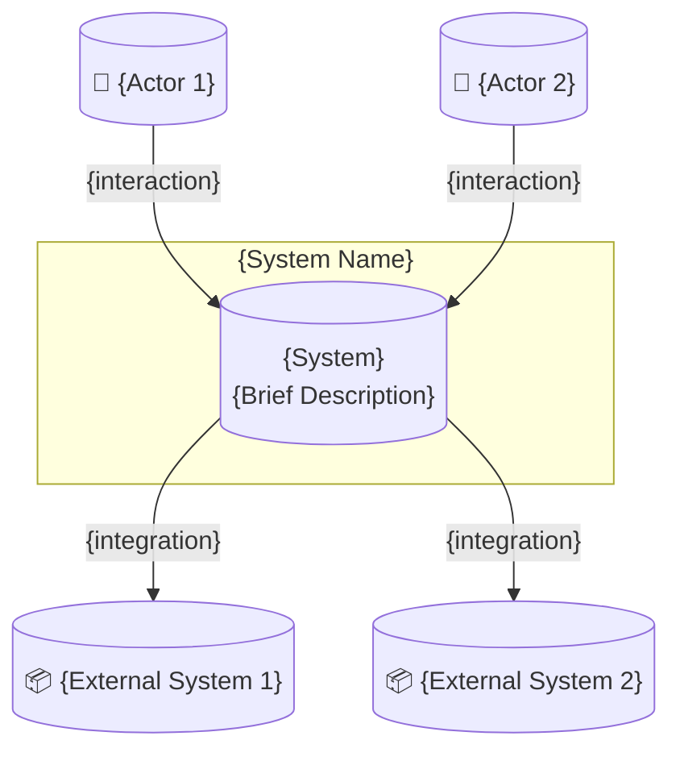
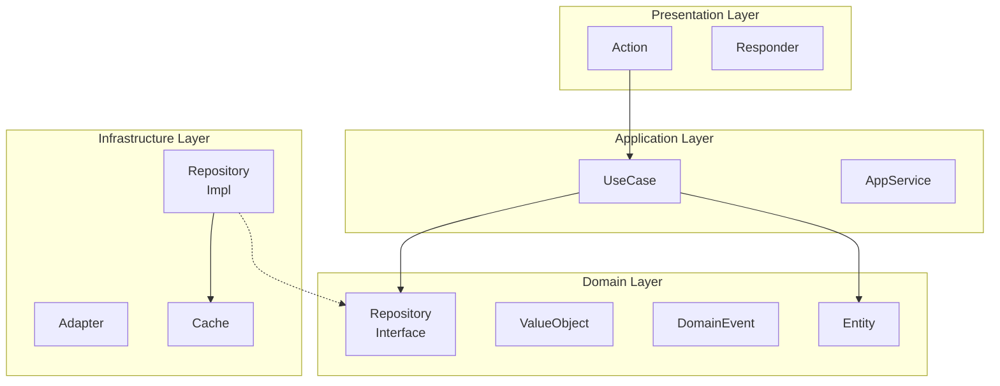
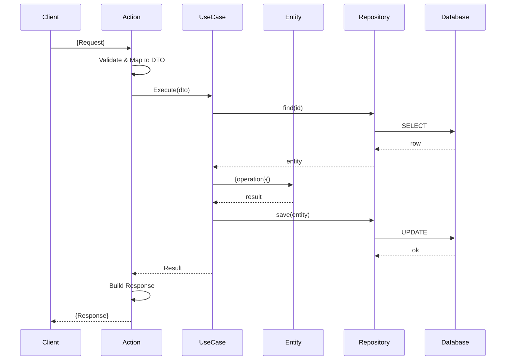
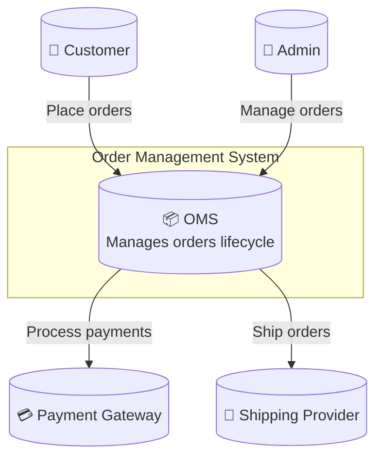

# Генератор шаблонов архитектурной документации

Генерация комплексной архитектурной документации для PHP-проектов.

## Структура документа

```markdown
# Architecture

## Overview
{высокоуровневое описание}

## Directory Structure
{аннотированное дерево проекта}

## System Context
{C4 контекстная диаграмма}

## Architecture Layers
{описания слоёв}

## Components
{описания компонентов}

## Data Flow
{диаграммы последовательностей}

## Technology Stack
{технологические решения}

## Architecture Decisions
{ссылки на ADR}

## Deployment
{диаграмма развёртывания}
```

## Шаблоны разделов

### Раздел структуры директорий

```markdown
## Directory Structure

```
project/
├── src/                           # Source code
│   ├── Domain/                    # Domain Layer (DDD)
│   │   ├── Entity/                # Domain entities
│   │   ├── ValueObject/           # Value objects
│   │   ├── Repository/            # Repository interfaces
│   │   ├── Service/               # Domain services
│   │   └── Event/                 # Domain events
│   ├── Application/               # Application Layer
│   │   ├── UseCase/               # Use cases / Commands / Queries
│   │   ├── DTO/                   # Data Transfer Objects
│   │   └── Service/               # Application services
│   ├── Infrastructure/            # Infrastructure Layer
│   │   ├── Persistence/           # Repository implementations
│   │   ├── Http/                  # HTTP clients
│   │   ├── Messaging/             # Queue adapters
│   │   └── Cache/                 # Cache adapters
│   └── Presentation/              # Presentation Layer
│       ├── Api/                   # REST API (Actions, Requests, Responses)
│       ├── Web/                   # Web controllers
│       └── Console/               # CLI commands
├── tests/                         # Test suite
│   ├── Unit/                      # Unit tests (mirrors src/)
│   ├── Integration/               # Integration tests
│   └── Functional/                # E2E / Functional tests
├── config/                        # Configuration files
├── public/                        # Web root
├── docker/                        # Docker configuration
└── docs/                          # Documentation
    ├── architecture/              # Architecture docs
    ├── adr/                       # Architecture Decision Records
    └── api/                       # API documentation
```

### Команда генерации

```bash
tree -L 3 -I 'vendor|node_modules|.git|var|cache' --dirsfirst
```

### Правила аннотации

| Правило | Описание |
|---------|----------|
| Имя слоя | Добавить DDD-слой в комментарии |
| Назначение | Описать назначение директории |
| Глубина | Максимум 3 уровня в основной документации |
| Детали | Ссылка на README поддиректорий |
```

### Раздел обзора

```markdown
## Overview

{Project Name} следует {Architecture Style} (например, Clean Architecture, DDD, Hexagonal).

### Key Principles

- **Separation of Concerns** — Каждый слой имеет чёткую ответственность
- **Dependency Rule** — Зависимости направлены внутрь (Domain в центре)
- **Testability** — Бизнес-логика изолирована от инфраструктуры
- **Framework Independence** — Ядро логики не зависит от фреймворков

### High-Level Structure

```
┌─────────────────────────────────────────┐
│            Presentation Layer           │
│         (Actions, Responders)           │
├─────────────────────────────────────────┤
│            Application Layer            │
│          (UseCases, Services)           │
├─────────────────────────────────────────┤
│              Domain Layer               │
│    (Entities, Value Objects, Events)    │
├─────────────────────────────────────────┤
│           Infrastructure Layer          │
│      (Repositories, Adapters, DB)       │
└─────────────────────────────────────────┘
```
```

### Раздел системного контекста

```markdown
## System Context



### Акторы

| Актор | Описание |
|-------|----------|
| {Actor 1} | {Описание} |
| {Actor 2} | {Описание} |

### Внешние системы

| Система | Назначение | Интеграция |
|---------|------------|------------|
| {System 1} | {Назначение} | {Protocol/API} |
| {System 2} | {Назначение} | {Protocol/API} |
```

### Раздел архитектурных слоёв

```markdown
## Architecture Layers

### Presentation Layer

**Ответственность:** Обработка HTTP-запросов и ответов

**Компоненты:**
- `Api/` — REST API endpoints (Actions + Responders)
- `Web/` — Веб-интерфейс (Actions + Responders)
- `Console/` — CLI-команды

**Правила:**
- Без бизнес-логики
- Валидация входных данных
- Вызов Application layer
- Форматирование вывода

### Application Layer

**Ответственность:** Оркестрация бизнес-операций

**Компоненты:**
- `UseCase/` — Бизнес-правила уровня приложения
- `Service/` — Сквозные сервисы приложения
- `DTO/` — Data Transfer Objects

**Правила:**
- Оркестрация доменных объектов
- Управление транзакциями
- Без инфраструктурных деталей

### Domain Layer

**Ответственность:** Ядро бизнес-логики

**Компоненты:**
- `Entity/` — Бизнес-объекты с идентичностью
- `ValueObject/` — Неизменяемые концепции-значения
- `Event/` — Domain events
- `Repository/` — Интерфейсы репозиториев
- `Service/` — Domain services

**Правила:**
- Без внешних зависимостей
- Чистая бизнес-логика
- Самовалидирующиеся объекты

### Infrastructure Layer

**Ответственность:** Технические реализации

**Компоненты:**
- `Persistence/` — Реализации репозиториев
- `Adapter/` — Адаптеры внешних сервисов
- `Cache/` — Реализации кеширования
- `Queue/` — Реализации очередей

**Правила:**
- Реализовать интерфейсы Domain
- Обрабатывать технические аспекты
- Без бизнес-логики
```

### Раздел компонентов

```markdown
## Components



### Описания компонентов

| Компонент | Слой | Ответственность |
|-----------|------|-----------------|
| Action | Presentation | Обработка HTTP-запросов |
| Responder | Presentation | Формирование HTTP-ответов |
| UseCase | Application | Оркестрация бизнес-операций |
| Entity | Domain | Бизнес-объект с идентичностью |
| ValueObject | Domain | Неизменяемая концепция-значение |
| Repository | Infrastructure | Хранение данных |
```

### Раздел потока данных

```markdown
## Data Flow

### Поток {Operation Name}


```

### Раздел технологического стека

```markdown
## Technology Stack

| Слой | Технология | Назначение |
|------|------------|------------|
| Язык | PHP 8.2 | Типобезопасность, современные возможности |
| Фреймворк | Symfony 7.x | HTTP, DI, Console |
| ORM | Doctrine 3.x | Абстракция БД |
| База данных | PostgreSQL 16 | Основное хранилище |
| Кеш | Redis 7.x | Сессии, кеш |
| Очереди | RabbitMQ 3.x | Асинхронная обработка |
| API | OpenAPI 3.1 | Спецификация API |

### Технологические решения

| Решение | Обоснование |
|---------|-------------|
| PostgreSQL вместо MySQL | Поддержка JSONB, лучшая система типов |
| Symfony вместо Laravel | Более явный, лучший DI |
| Redis вместо Memcached | Структуры данных, персистентность |
```

### Раздел ссылки на ADR

```markdown
## Architecture Decisions

Ключевые решения документированы как ADR:

| ADR | Статус | Заголовок |
|-----|--------|-----------|
| [ADR-001](docs/adr/001-use-ddd.md) | Принято | Использовать DDD Architecture |
| [ADR-002](docs/adr/002-cqrs.md) | Принято | Реализовать CQRS |
| [ADR-003](docs/adr/003-event-sourcing.md) | Предложено | Рассмотреть Event Sourcing |
```

## Полный пример

```markdown
# Architecture

## Overview

Order Management System следует Domain-Driven Design с принципами Clean Architecture.

### Key Principles

- **Domain-Centric** — Бизнес-логика в Domain layer
- **Dependency Inversion** — Абстракции вместо реализаций
- **Bounded Contexts** — Order, Inventory, Shipping

## Directory Structure

```
order-management/
├── src/
│   ├── Order/                     # Order Bounded Context
│   │   ├── Domain/                # Domain Layer
│   │   ├── Application/           # Application Layer
│   │   ├── Infrastructure/        # Infrastructure Layer
│   │   └── Presentation/          # Presentation Layer
│   ├── Inventory/                 # Inventory Bounded Context
│   └── Shipping/                  # Shipping Bounded Context
├── tests/
├── config/
└── docs/
```

## System Context



## Architecture Layers

[... описания слоёв ...]

## Technology Stack

| Слой | Технология | Назначение |
|------|------------|------------|
| Язык | PHP 8.2 | Типобезопасность |
| Фреймворк | Symfony 7.2 | HTTP, DI |
| База данных | PostgreSQL 16 | Хранилище |
| Кеш | Redis 7.4 | Производительность |
| Очереди | RabbitMQ 3.13 | Асинхронность |

## Architecture Decisions

| ADR | Статус | Заголовок |
|-----|--------|-----------|
| [ADR-001](docs/adr/001-ddd.md) | Принято | Использовать DDD |
| [ADR-002](docs/adr/002-cqrs.md) | Принято | Использовать CQRS |
```

## Инструкции по генерации

При генерации ARCHITECTURE.md:

1. **Проанализировать** структуру проекта для определения организации слоёв
2. **Определить** архитектурный стиль (DDD, Clean, Hexagonal)
3. **Сопоставить** компоненты со слоями
4. **Создать** контекстную диаграмму с акторами и системами
5. **Сгенерировать** диаграмму компонентов
6. **Перечислить** технологический стек из `composer.json`
7. **Привязать** существующие ADR при наличии
