# Mermaid Syntax Reference

## Flowchart

### Directions

```
TB / TD - Top to Bottom
BT - Bottom to Top
LR - Left to Right
RL - Right to Left
```

### Node Shapes

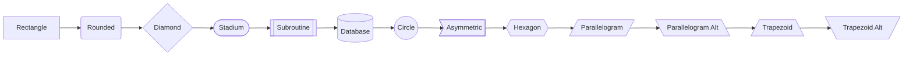

### Arrow Types

```
A --> B    Solid line with arrow
A --- B    Solid line
A -.-> B   Dotted line with arrow
A -.- B    Dotted line
A ==> B    Thick line with arrow
A === B    Thick line
A --o B    Circle end
A --x B    Cross end
A <--> B   Bidirectional
```

### Arrow Labels

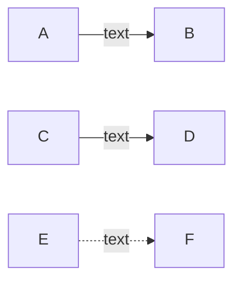

### Subgraphs

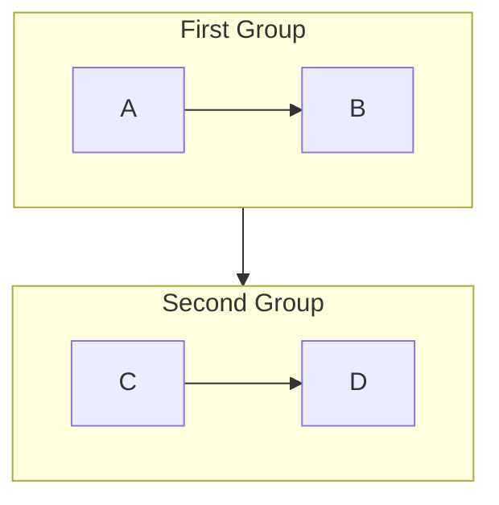

## Sequence Diagram

### Participants

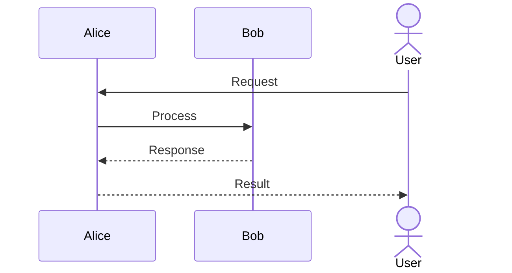

### Message Types

```
->>   Solid line (synchronous)
-->>  Dashed line (response/async)
-)    Solid line, open arrow
--)   Dashed line, open arrow
-x    Solid line, cross end
--x   Dashed line, cross end
```

### Control Flow

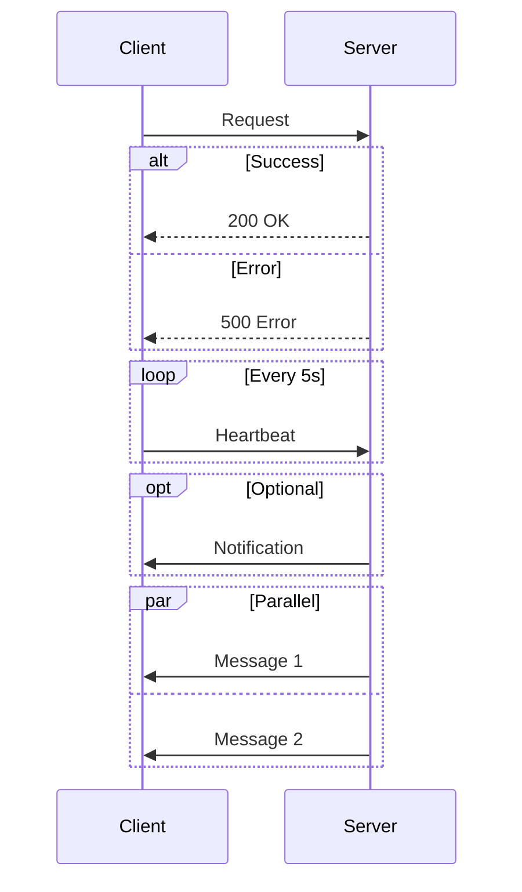

### Notes

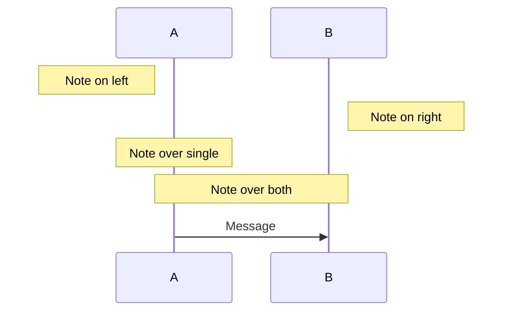

### Activation

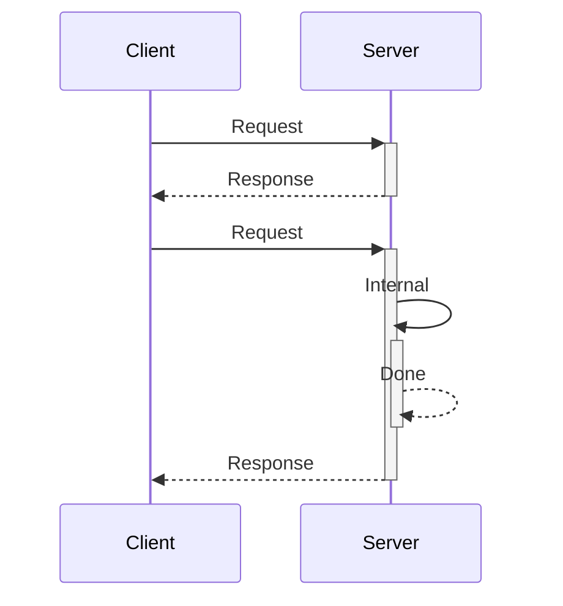

## Class Diagram

### Class Definition

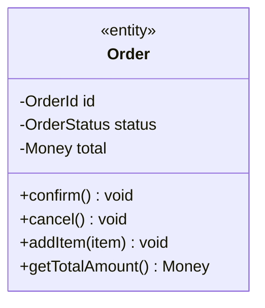

### Visibility

```
+ Public
- Private
# Protected
~ Package/Internal
```

### Relationships

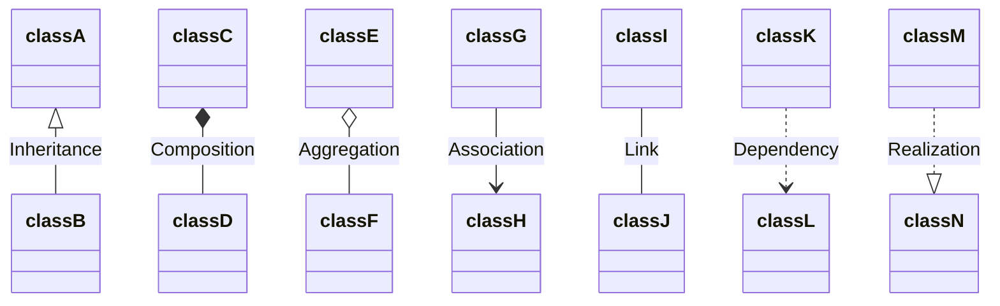

### Cardinality

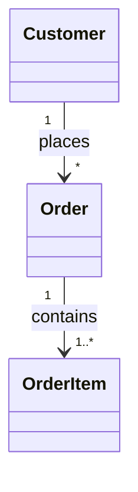

## State Diagram

### Basic States

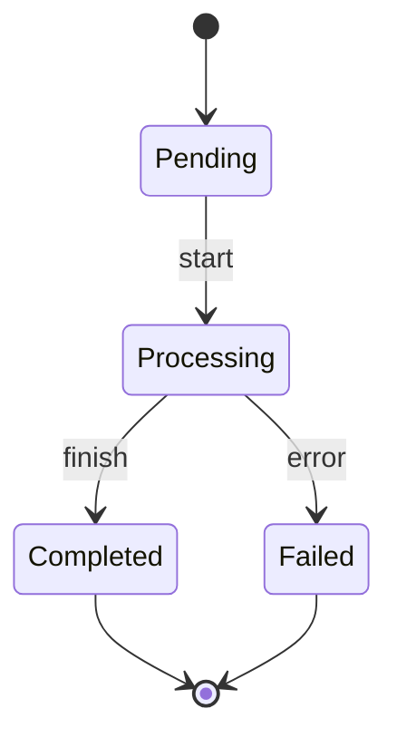

### Composite States

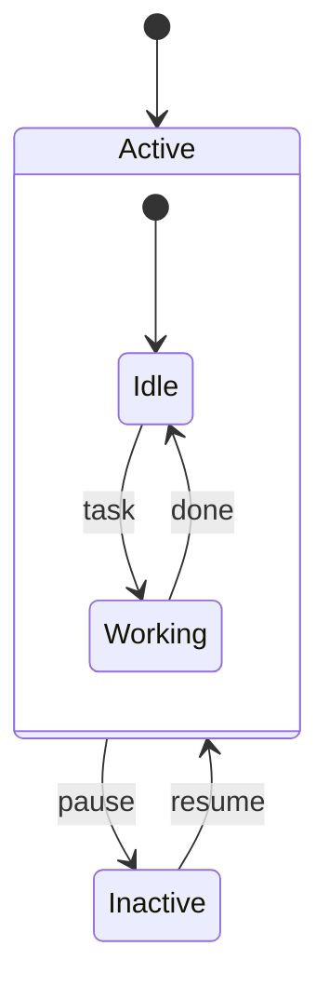

### Choice and Fork

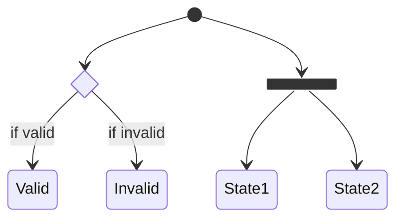

## ER Diagram

### Entities and Attributes

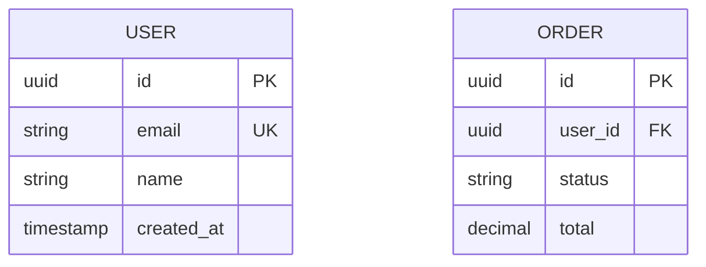

### Relationships

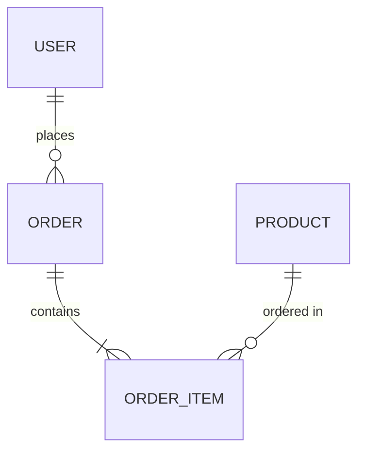

### Cardinality Notation

```
||--||  Exactly one to exactly one
||--o{  One to zero or more
||--|{  One to one or more
}|--|{  One or more to one or more
```

## Styling

### Inline Styles

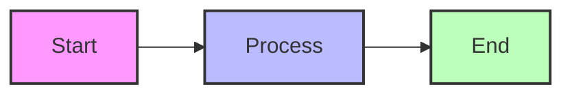

### Class Definitions

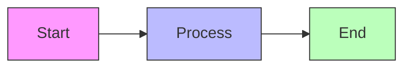
