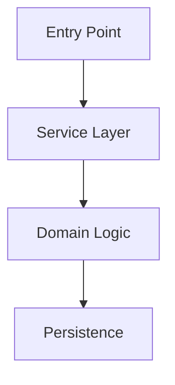
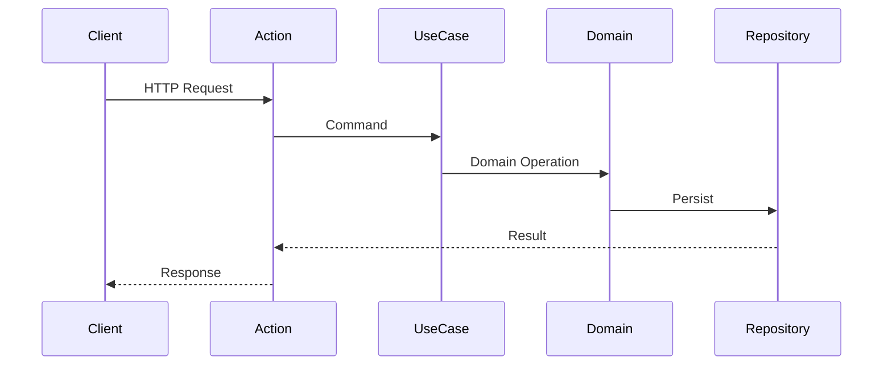
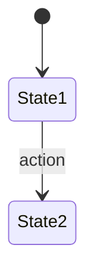
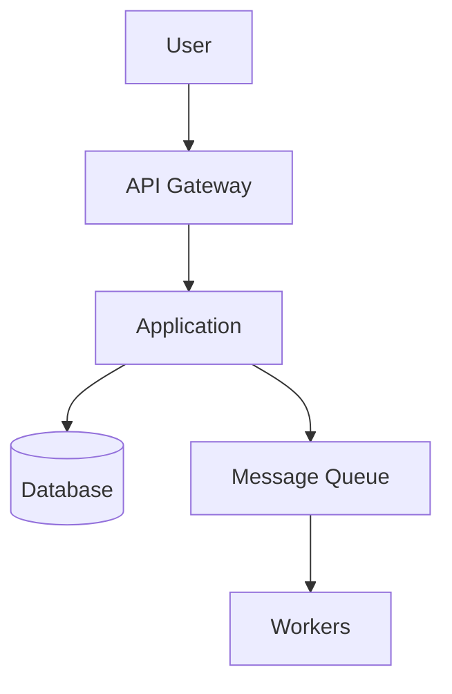
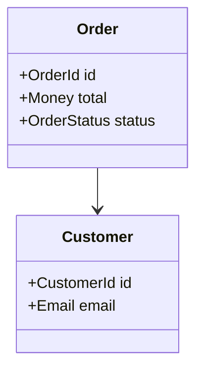
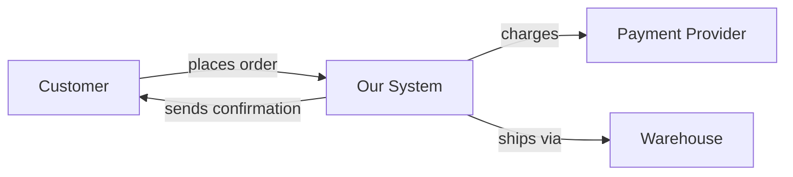

# Explain Output Templates

## Overview

Provides structured output templates for the 5 explanation modes. Each template defines sections, content depth, and formatting requirements for consistent, high-quality explanations.

## Mode Selection

| Mode | Target | Depth | Audience | Trigger |
|------|--------|-------|----------|---------|
| `quick` | Single file | 1-2 screens | Developer | File path |
| `deep` | Module/directory | Full analysis | Senior dev / Architect | Directory path |
| `onboarding` | Entire project | Comprehensive guide | New team member | `.` or project root |
| `business` | Feature/process | Non-technical | PM / Stakeholder | Explicit mode |
| `qa` | On-demand | Answer-focused | Any | Explicit mode |

## Template: Quick Mode

For single file analysis. Compact, fits 1-2 terminal screens.

```markdown
# Explanation: {FileName}

## Purpose
{One sentence — what this class/file does and why it exists.}

## Business Context
{Which business process or domain concept this participates in.}

## Key Responsibilities
- {Responsibility 1 — what it does}
- {Responsibility 2 — what it does}
- {Responsibility 3 — what it does}

## Business Rules
| Rule | Location | Description |
|------|----------|-------------|
| {rule name} | Line {N} | {what the rule enforces} |

## Data Flow
```
{Entry} → {Processing step 1} → {Processing step 2} → {Output}
```

## Dependencies
| Dependency | Role | Direction |
|------------|------|-----------|
| {ClassName} | {what it provides} | {inbound/outbound} |

## Important Notes
- {Non-obvious behavior, edge case, or architectural decision}
```

**Guidelines:**
- Maximum 40-50 lines of output
- No diagrams (too verbose for quick mode)
- Focus on "what" and "why", not "how"
- Use business language where possible

## Template: Deep Mode

For module/directory analysis. Full analysis with diagrams.

```markdown
# Deep Explanation: {Module/Directory Name}

## Overview
{2-3 sentences — what this module does, its role in the system, key design decisions.}

## Architecture
{Mermaid component diagram showing internal structure}



## Components

### Layer Map
| Layer | Files | Key Classes |
|-------|-------|-------------|
| Presentation | {N} | {Controller, Action} |
| Application | {N} | {UseCase, Service} |
| Domain | {N} | {Entity, VO, Service} |
| Infrastructure | {N} | {Repository, Adapter} |

### Key Classes
{For each important class: purpose, responsibilities, relationships}

## Business Processes
{List of business processes in this module, with actor/trigger/steps}

### Process: {ProcessName}
**Trigger:** {what starts it}
**Actor:** {who initiates}
**Steps:**
1. {step 1}
2. {step 2}
3. {step 3}

## Data Flow

### Main Request Flow


### Data Transformation Chain
| Step | Class | Input Type | Output Type |
|------|-------|-----------|-------------|
| {step} | {class} | {type} | {type} |

## Domain Model
{Domain concepts glossary for this module}

| Concept | Class | Type | Description |
|---------|-------|------|-------------|
| {concept} | {Class} | Entity/VO/Enum | {what it represents} |

## State Machines (if applicable)


## Business Rules
| # | Rule | Location | Enforcement |
|---|------|----------|-------------|
| {N} | {rule description} | {file:line} | {how enforced} |

## Async Flows (if applicable)
| Event/Message | Publisher | Consumer | Queue |
|---------------|-----------|----------|-------|
| {event} | {class} | {handler} | {queue} |

## Quality Observations
{Findings from structural/behavioral auditors}
- {observation 1}
- {observation 2}

## Suggested Documentation
{Documentation suggestion — see coordinator behavior}
```

**Guidelines:**
- Include Mermaid diagrams (component, sequence, state)
- Cover all aspects: architecture, business, data, state
- Depth proportional to module complexity
- Include quality observations from auditors

## Template: Onboarding Mode

For entire project. Comprehensive getting-started guide.

```markdown
# Project Guide: {Project Name}

## What Is This Project?
{2-3 sentences in plain language — what the project does, who uses it, why it exists.}

## Tech Stack
| Technology | Purpose | Version |
|-----------|---------|---------|
| PHP | Backend language | 8.4 |
| {Framework} | Web framework | {version} |
| {DB} | Database | {version} |
| {Queue} | Message queue | {version} |

## Architecture Overview
{High-level C4 Context diagram}



## Project Structure
```
{Full directory tree with annotations}
src/
├── Domain/           # Business rules, entities, value objects
├── Application/      # Use cases, commands, queries
├── Infrastructure/   # Database, cache, queue implementations
└── Presentation/     # HTTP controllers, CLI commands
```

## Bounded Contexts / Modules
| Module | Purpose | Key Entity | Entry Points |
|--------|---------|-----------|-------------|
| {module} | {what it does} | {main entity} | {routes/commands} |

## Key Business Processes
{Top 5-10 most important business processes}

### 1. {Process Name}
{Brief description with actor, trigger, outcome}

### 2. {Process Name}
{Brief description}

## API Endpoints (Top Routes)
| Method | Route | Purpose | Auth |
|--------|-------|---------|------|
| GET | /api/... | {purpose} | {auth type} |

## Domain Model
{Key domain concepts and their relationships}



## Data Flow Overview
{How data moves through the system — main happy path}

## Async Communication
{Queue topology, event flows, scheduled tasks}

## How to Navigate the Code
| "I want to..." | Start here |
|-----------------|-----------|
| Understand business logic | `src/Domain/` |
| See API endpoints | `src/Presentation/Api/` |
| Find a use case | `src/Application/UseCase/` |
| Check database queries | `src/Infrastructure/Repository/` |
| Add a new feature | Follow existing UseCase pattern |

## Glossary
| Term | Meaning | Code Reference |
|------|---------|---------------|
| {term} | {definition} | {class name} |

## Suggested Documentation
{Documentation suggestion — see coordinator behavior}
```

**Guidelines:**
- Write for someone seeing the project for the first time
- Include "How to navigate" section
- Build comprehensive glossary
- Use C4 diagrams for architecture
- Keep language accessible

## Template: Business Mode

For non-technical stakeholders. No code references.

```markdown
# {Feature/System} — Business Overview

## What Does It Do?
{Plain language explanation — no technical jargon.}

## Who Uses It?
| Actor | What They Do |
|-------|-------------|
| {role} | {their interaction with the system} |

## Key Business Processes

### {Process 1}
**When:** {trigger in business terms}
**What happens:**
1. {step in business language}
2. {step}
3. {step}
**Result:** {outcome}

## Business Rules
| Rule | Why It Exists |
|------|--------------|
| {rule in plain language} | {business justification} |

## Data & Reports
| Data | What It Shows | Updated |
|------|--------------|---------|
| {data point} | {what it means} | {frequency} |

## System Interactions


## Limitations & Constraints
- {business limitation 1}
- {business limitation 2}
```

**Guidelines:**
- Zero code references
- Business language only
- Focus on "what" and "why", never "how" technically
- Use simple flow diagrams

## Template: QA Mode

For interactive question-answering.

```markdown
## Question: {User's Question}

### Answer
{Direct, concise answer to the question.}

### Details
{Supporting explanation with evidence from code.}

### Code References
| File | Line | Relevance |
|------|------|-----------|
| {file} | {line} | {why this is relevant} |

### Related
- {Related concept or question the user might want to explore next}
```

**Guidelines:**
- Answer the specific question first
- Provide supporting evidence
- Suggest related areas to explore
- Keep focused — don't explain everything

## Documentation Suggestion Block

Append to all modes except `qa`:

```markdown
---

## Suggested Documentation

{One of the following based on analysis:}

### Existing documentation found:
- `{path/to/doc}` — consider updating with insights from this analysis

### No documentation found:
Consider generating documentation:
```
/acc-generate-documentation {analyzed_path}
```
```

## Integration

This skill is used by:
- `acc-explain-coordinator` — selects template based on mode, formats final output
